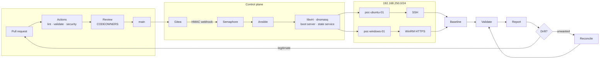

# FORGE-AI

**GitOps infrastructure provisioning — from a Git commit to two running,
configured, verified machines, with nothing touched by hand.**

A working proof of concept that takes an Ubuntu Server and a Windows
Server virtual machine from bare disk to operational: network boot,
unattended installation, post-install configuration, compliance
validation, drift detection and reconciliation — all driven by a
declarative desired state in version control.

```text
commit → GitHub Actions → Gitea → webhook → Semaphore → Ansible
       → KVM/libvirt → PXE/iPXE → unattended install → SSH/WinRM
       → baseline → validation → report → drift → reconcile
```

> **Status — v0.1.0, validated on real hardware.** Both provisioning
> paths have completed end-to-end on a physical deployment
> (2026-08-30): `make provision-ubuntu` and `make provision-windows`
> each from bare disk to an OS reachable by Ansible, exit code 0,
> nothing touched by hand. The campaign that got there — 42 bugs
> found, fixed and regression-tested on real hardware — is documented
> commit by commit in [docs/logbook/](docs/logbook/), with
> [logbook_finale.md](docs/logbook/logbook_finale.md) as the summary.

---

## What it does

| | |
|---|---|
| **Provisions two VMs** | `poc-ubuntu-01` (Ubuntu Server 24.04) and `poc-windows-01` (Windows Server 2025) |
| **From nothing** | No golden image, no manual install, no console access |
| **Over the network** | PXE/iPXE, UEFI-first, architecture-aware |
| **Unattended** | Subiquity autoinstall and `Autounattend.xml`, both generated from the desired state |
| **Then configures them** | Ansible over SSH and WinRM/HTTPS |
| **Then verifies them** | By reading the machines, not by trusting an exit code |
| **Then watches them** | Drift detection with two independent sources |
| **And reports** | JSON, Markdown and HTML, including *why* a run failed |

Everything about the two machines — names, addresses, MAC addresses,
resources, baseline policy — is one file: `config/poc.yml`.

---

## Architecture



Full detail, including the boot dispatch state machine and every
designed-in failure mode: **[docs/ARCHITECTURE.md](docs/ARCHITECTURE.md)**.

---

## Components

| Layer | What |
|---|---|
| **Upstream** | GitHub — where development and review happen |
| **GitOps** | Gitea (internal, read-only mirror) · webhook receiver (HMAC-verified) |
| **Automation** | Semaphore UI · Ansible Core · 17 roles · 15 playbooks |
| **Virtualisation** | KVM · QEMU · libvirt · OVMF (UEFI) |
| **Boot** | dnsmasq (DHCP/DNS/TFTP) · iPXE · wimboot · nginx |
| **State** | A small service that owns per-MAC dispatch and the reinstall-loop guard |
| **Targets** | Ubuntu Server 24.04 LTS · Windows Server 2025 |

---

## Prerequisites

| Requirement | Minimum |
|---|---|
| **Ubuntu 24.04 LTS**, x86_64 | The only validated control host |
| Hardware virtualisation | `vmx` or `svm` in `/proc/cpuinfo` |
| RAM | 16 GB (12 GB targets + 4 GB control plane) |
| Free disk | 150 GB |
| Root or sudo | libvirt, dnsmasq, `/srv`, Docker |
| Outbound HTTPS | The Ubuntu ISO and container images |

```bash
./bootstrap/check-prerequisites.sh
```

34 read-only checks. The memory and disk requirements are **computed
from your `config/poc.yml`**, not hardcoded, and every failure prints
the command that fixes it.

### Media you must supply

**Windows Server media is yours.** Nothing from Microsoft is in this
repository — no ISO, no `boot.wim`, no `install.wim`, no ADK component,
no product key. Download Windows Server Evaluation media from the
Microsoft Evaluation Center under their licensing terms and point
`config/poc.yml` at it.

The Ubuntu target deploys perfectly well without it. See
**[docs/WINDOWS-PROVISIONING.md](docs/WINDOWS-PROVISIONING.md)**.

---

## ⚠ Before you run this

**This project runs a DHCP server.**

It is bound to an isolated libvirt bridge and nothing else, which is
what makes it safe. But if you point `provisioning_network` at a subnet
that already exists on your LAN, you will hand addresses to machines
that have nothing to do with this PoC — and the failure will be
intermittent enough to get blamed on something else.

`make check` probes for a competing DHCP server before anything is
created. Do not skip it.

Other things to know before starting:

- It creates and destroys virtual machines, disks and network
  configuration on the host it runs on.
- The generated secrets are for a proof of concept. Do not reuse them.
- Several production controls are **documented rather than
  implemented** — Secure Boot is off, WinRM uses a self-signed
  certificate, and there is one shared local administrator password.
  Each is listed with its production alternative in
  **[docs/SECURITY.md](docs/SECURITY.md)**.

---

## Quick start

```bash
git clone https://github.com/danielesalpietro/FORGE-AI.git && cd FORGE-AI

cp compose/.env.example compose/.env
cp config/poc.example.yml config/poc.yml
$EDITOR config/poc.yml                    # set media.windows.iso_path

make check                                # can this host do it?
make bootstrap                            # secrets, network, control plane
make windows-images                        # copy the edition name into config
make prepare-media                        # download and unpack the installers
make provision                            # create the VMs, install both OSes
make configure                            # apply the baselines
make validate-deployment                  # verify, and write the report
```

About 20 minutes of your attention, plus 30–60 minutes of unattended
installation.

**[docs/QUICKSTART.md](docs/QUICKSTART.md)** is the version with
explanations.

---

## Main commands

```text
make help
```

| Command | Does |
|---|---|
| `make check` | 34 read-only prerequisite checks |
| `make validate` | Schema, template rendering, Ansible syntax, 245 tests |
| `make lint` | yamllint, ansible-lint (production profile), ShellCheck |
| `make bootstrap` | Secrets, network, control plane, Gitea, Semaphore |
| `make prepare-media` | Download, verify and unpack the installers |
| `make provision` | Create the VMs and install both operating systems |
| `make configure` | Apply the baselines over SSH and WinRM |
| `make validate-deployment` | Validate, check idempotence, write the report |
| `make state` | Where each host is in its lifecycle |
| `make drift` | Detect drift. Changes nothing. |
| `make reconcile` | Reapply the desired state, then prove it took |
| `make report` | The latest deployment report |
| `make destroy CONFIRM=DESTROY-POC` | Remove the VMs, PXE services and network |

---

## The lifecycle

```text
No VM
  → VM definition          libvirt domain, network boot first
  → Network boot           dnsmasq → iPXE → state service decides
  → Unattended install     Subiquity, or WinPE → setup.exe /unattend
  → First boot             boot order flipped to local disk
  → Ansible bootstrap      SSH key, or WinRM over HTTPS
  → Target configuration   baseline roles, idempotent
  → Validation             services, policy, read-only probes
  → Operational state      reported, and watched for drift
```

Each stage is a standalone playbook, so a failure is resumed from where
it failed rather than from the beginning.

---

## Verification

```bash
make validate            # everything CI runs, locally
./scripts/smoke-test.sh  # against the real machines
```

| Layer | Count | Needs |
|---|---|---|
| Unit tests | 216 | Nothing |
| Shell tests | 29 | `bats` |
| Molecule | 1 scenario | Docker |
| Integration | 10 | A live control plane |
| Smoke test | 20+ checks | Provisioned VMs |

The unit tests cover configuration validation, all 23 templates rendered
under `StrictUndefined`, `Autounattend.xml` parsed pass by pass, the
Windows password encoding round-trip, **the reinstall-loop guard**, and
secret hygiene — tested against *planted* secrets, not just a clean
tree.

CI runs everything except deploying. GitHub-hosted runners have no
nested virtualisation, so no VM is created there. The end-to-end
workflow exists at `.github/workflows/e2e-selfhosted.yml`, **disabled
rather than deleted**, so that gap stays checkable.

---

## Teardown

```bash
make destroy CONFIRM=DESTROY-POC        # VMs, disks, PXE services, network
make destroy-all CONFIRM=DESTROY-POC    # also media and the control plane
```

Three independent confirmations, because a UI control is not a security
boundary. Deployment reports are **never** removed — they are the audit
trail.

---

## Limitations

The honest summary. Every item is expanded, with its production
alternative, in **[docs/LIMITATIONS.md](docs/LIMITATIONS.md)**.

- **It is a proof of concept.** Two VMs, one host, no HA, no backup
  automation, no monitoring.
- **Secure Boot is off.** The distribution's iPXE is not signed by a key
  in the default OVMF `db`.
- **WinRM uses a self-signed certificate**, so `winrm_cert_validation`
  defaults to `ignore`. It is a single named switch, and every tool that
  honours it says so when it runs.
- **One shared local administrator password.** No domain means no
  Kerberos and no LAPS. The baseline *reports* LAPS readiness so the gap
  is visible.
- **Check mode is not complete**, and this is not hidden: `win_shell`
  and `win_updates` have no check-mode support at all, which is why
  every control also has a read-only compliance probe and the drift
  report records its own blind spots.
- **The "CIS-inspired" controls are not a CIS benchmark run.** The role
  says so in its own output.
- **Windows media is operator-supplied**, and activation is out of
  scope.

---

## Roadmap

The next phases are tracked as GitHub issues, each broken into
sub-issues with per-phase checklists:

| Initiative | Issue |
|---|---|
| **Project review** — consolidation, unattended tests directly on ESXi, then the full pipeline (`make configure` → smoke → idempotence → drift) | [#5](https://github.com/danielesalpietro/FORGE-AI/issues/5) |
| **Self-hosted runner** on real hardware, for the regression tests that only reproduce there | [#10](https://github.com/danielesalpietro/FORGE-AI/issues/10) |
| **Environment lifecycle** — Dev → Staging → Prod on ESXi, shared storage, versioned promotion procedures, go/no-go and rollback | [#11](https://github.com/danielesalpietro/FORGE-AI/issues/11) |
| **Asset inventory (`dims.db`)** — hardware and software described as data generated from the live systems, SBOM included, so a configuration can be reproduced on compatible hardware | [#15](https://github.com/danielesalpietro/FORGE-AI/issues/15) |
| **Secrets vault** — one place for every secret, then SSL keys and an internal CA | [#20](https://github.com/danielesalpietro/FORGE-AI/issues/20) |
| **`dims` control plane** — multi-node API and a pipe-composable CLI over environments | [#26](https://github.com/danielesalpietro/FORGE-AI/issues/26) |

Hardening items that stay on the list independently of the phases:

1. Domain join and Kerberos — removes the shared local administrator
2. Windows LAPS, once a directory exists
3. Secure Boot with signed boot components
4. Backup and restore for the Gitea and Semaphore volumes
5. Log shipping, and alerting on install-attempt exhaustion
6. More compliance probes, particularly on Windows
7. Bare-metal targets over Redfish
8. GPG signature verification on `SHA256SUMS`

---

## Documentation

| Document | Covers |
|---|---|
| [QUICKSTART.md](docs/QUICKSTART.md) | Running it without reading everything else |
| [ARCHITECTURE.md](docs/ARCHITECTURE.md) | How it works, and every designed-in failure mode |
| [GITOPS-WORKFLOW.md](docs/GITOPS-WORKFLOW.md) | GitHub → Gitea → Semaphore, and why |
| [UBUNTU-PROVISIONING.md](docs/UBUNTU-PROVISIONING.md) | The Ubuntu path in detail |
| [WINDOWS-PROVISIONING.md](docs/WINDOWS-PROVISIONING.md) | The Windows path, and the media you supply |
| [SEMAPHORE-SETUP.md](docs/SEMAPHORE-SETUP.md) | Templates, key store, schedules |
| [OPERATIONS.md](docs/OPERATIONS.md) | Day-two: drift, reports, recovery |
| [SECURITY.md](docs/SECURITY.md) | Threat model, mitigations, residual risk |
| [TROUBLESHOOTING.md](docs/TROUBLESHOOTING.md) | Symptom → cause → fix |
| [LIMITATIONS.md](docs/LIMITATIONS.md) | What this deliberately does not do |
| [DEMO-RUNBOOK.md](docs/DEMO-RUNBOOK.md) | A 30–45 minute walkthrough |
| [COMPATIBILITY.md](docs/COMPATIBILITY.md) | Exactly what was tested |
| [REFERENCES.md](docs/REFERENCES.md) | The official sources, and what each settled |

The [GitHub wiki](https://github.com/danielesalpietro/FORGE-AI/wiki) is a
map of all of this for a first-time reader; its pages are written and
reviewed in [docs/wiki/](docs/wiki/), then published.

---

## Contributing

[CONTRIBUTING.md](CONTRIBUTING.md). In short: `make validate` must pass,
new behaviour needs a test, and say what you actually verified — "I
deployed the Ubuntu target; the Windows path is untested because I have
no media" is far more useful than an unqualified tick.

---

## Licence

Apache License 2.0 — see [LICENSE](LICENSE).

Chosen over MIT for its **explicit patent grant** and its requirement to
state changes: this is infrastructure automation that organisations will
adapt, and both matter more here than the brevity of MIT.

Third-party components, their licences and the attribution they require
are in [THIRD_PARTY_NOTICES.md](THIRD_PARTY_NOTICES.md) — including
iPXE, whose attribution must be preserved.

**No Microsoft media, binary or product key is distributed by this
repository.**
