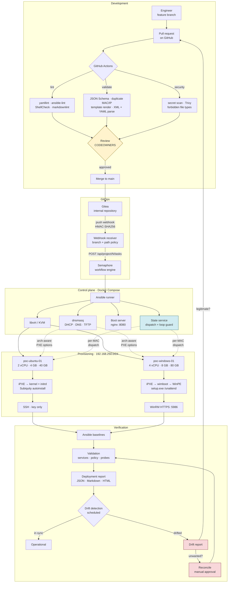
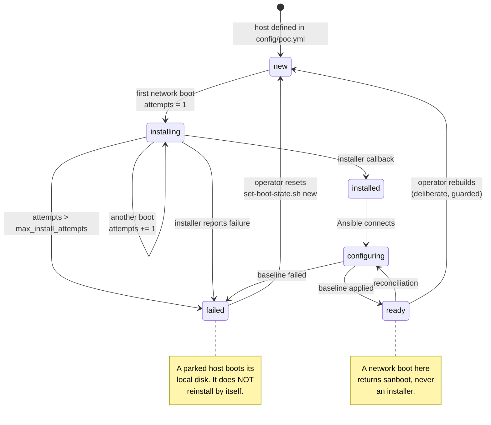

# Architecture

How a commit becomes two running, configured, verified machines — and
what happens when it does not.

---

## The whole path



The two shaded decision points are where this design differs most from a
naive pipeline:

- **Review is a gate, not a formality.** Semaphore reads Gitea, and
  Gitea mirrors `main`. Nothing on a feature branch can reach a machine.
- **Drift never fixes itself.** The report asks whether the deviation is
  legitimate. If it is, the fix is a pull request — not a reconcile that
  erases the evidence.

---

## Components

| Component | Runs as | Purpose |
|---|---|---|
| **GitHub** | — | Where development happens and where review is enforced |
| **Gitea** | container | The internal GitOps repository Semaphore reads. Never accepts a push from a developer. |
| **Semaphore** | container | Workflow engine, key store and audit trail |
| **PostgreSQL** | container | One role and database per application |
| **Webhook receiver** | container | Verifies HMAC **before parsing**, applies branch and path policy |
| **State service** | container | Per-MAC boot dispatch and the reinstall-loop guard |
| **Boot server** | container | nginx on the bridge address; everything large moves over HTTP |
| **SMB export** | container | Read-only `install.wim` for WinPE, which cannot mount HTTP |
| **Proxy** | container | TLS termination for Gitea and Semaphore |
| **dnsmasq** | systemd | DHCP, DNS and TFTP, bound **only** to the libvirt bridge |
| **libvirt / KVM** | systemd | The hypervisor |

Only two things are published on the provisioning network: the boot
server on `:8080` and, when a Windows target exists, the SMB export on
`:445`. Gitea and Semaphore listen on loopback.

---

## Network

```text
                        KVM host
   ┌──────────────────────────────────────────────────────────┐
   │                                                          │
   │  127.0.0.1                     192.168.250.1             │
   │  ┌────────────────────┐        ┌──────────────────────┐  │
   │  │ Gitea      :2222   │        │ boot server   :8080  │  │
   │  │ proxy      :8443   │        │ SMB export     :445  │  │
   │  │ Semaphore (proxied)│        │ dnsmasq DHCP    :67  │  │
   │  └────────────────────┘        │ dnsmasq TFTP    :69  │  │
   │                                └──────────┬───────────┘  │
   │                                           │              │
   │                          virbr-forge (libvirt, NAT)      │
   └───────────────────────────────────────────┼──────────────┘
                                               │
              ┌────────────────────────────────┴──────────────┐
              │                                               │
     poc-ubuntu-01                                   poc-windows-01
     192.168.250.21                                  192.168.250.22
     52:54:00:25:00:21                               52:54:00:25:00:22
```

| Range | Use |
|---|---|
| `192.168.250.1` | Gateway, and every service the targets reach |
| `.21`–`.22` | Static reservations, one per host |
| `.100`–`.199` | Dynamic pool — a host reservation inside it is **rejected** by `make validate` |

`forward_mode: nat` gives outbound access, which the Ubuntu installer
needs to reach the archive. `isolated` works air-gapped but requires a
local mirror.

### Why libvirt does not serve DHCP

The network XML has `<dns enable="no"/>` and **no `<dhcp>` element**.
libvirt only spawns its own dnsmasq when a network needs DHCP or DNS;
with neither, it creates the bridge and the NAT rules and stops.

FORGE-AI needs `dhcp-match` on DHCP option 93 for architecture detection
and `dhcp-boot` with `tag:!ipxe` for loop prevention. libvirt's network
XML can express neither. Two DHCP servers on one bridge is the classic
cause of *intermittent* PXE failure, so the `libvirt_network` role
**fails immediately** if it finds `/var/lib/libvirt/dnsmasq/<network>.conf`.

---

## Boot dispatch and the reinstall-loop guard

This is the part most worth understanding, because getting it wrong in
either direction is expensive.



Every request to `/state/<mac>.ipxe` **increments an attempt counter**.
Past `pxe.max_install_attempts` the service stops offering the installer
and parks the host as `failed`.

Without that counter, a host that fails halfway through installation
reinstalls forever. It looks *busy* rather than *broken*, which is the
worst failure mode a provisioning system has: nobody investigates
something that appears to be working.

### Belt and braces

The boot order in the libvirt domain is the second half of the guard:

| Phase | Domain XML | Decided by |
|---|---|---|
| Provisioning | `network`, then `hd` | `vm_lifecycle` |
| Installed | `hd`, then `network` | `vm_lifecycle/set-boot-order.yml` |

If the state service were lost entirely, an installed VM would still
come up on its own disk.

**Documented failure modes** (`ansible/roles/vm_lifecycle/README.md`):

- A domain redefinition only takes effect on the *next* boot. A VM
  mid-reboot uses the old order once — the state service covers that.
- **UEFI NVRAM keeps its own boot order**, independent of libvirt. The
  Ubuntu autoinstall runs `efibootmgr`; Windows Setup writes its own
  entry; `destroy.yml` passes `--nvram` for exactly this reason.

---

## Configuration flows one way

```text
config/defaults.yml  ─┐
                      ├─► deep merge ─► JSON Schema ─► semantic rules ─┐
config/poc.yml       ─┘                                                │
                                                                       ▼
                                              ┌────────────────────────────────┐
                                              │  forge-inventory.py            │
                                              │  refuses to build an inventory │
                                              │  from an invalid configuration │
                                              └────────────┬───────────────────┘
                                                           │
                    ┌──────────────────────────────────────┼───────────────────┐
                    ▼                    ▼                 ▼                   ▼
              Ansible groups        Jinja2 templates   dnsmasq config    state registry
              and host vars         (21 of them)       reservations      MAC → host
```

There is exactly one definition of every address, MAC and resource. A
static inventory would restate them, the two would drift, and drift in
an inventory is how a playbook configures the wrong machine.

With `any_unparsed_is_failed` in `ansible.cfg`, **an invalid desired
state cannot reach a target**: the run stops at inventory parse time.

### What validation rejects

| Rule | Why |
|---|---|
| Duplicate IP or MAC | Two hosts fighting over one reservation |
| Host outside the CIDR | dnsmasq will never answer it |
| Host inside the DHCP pool | Eventually collides with a dynamic lease |
| Host equal to the gateway | Collides with the control plane |
| `control_plane.address ≠ gateway` | The boot server binds the bridge address |
| Netmask inconsistent with the CIDR | Silent routing failure |
| Non-locally-administered MAC | Could collide with real hardware |
| Neither `image_name` nor `image_index` | Index 1 is not a safe assumption |
| A live secret in configuration | Belongs in the vault or key store |

---

## Installation paths

### Ubuntu

```text
iPXE ─► casper/vmlinuz + casper/initrd        extracted from the ISO
     ─► url=…/ubuntu.iso                      casper fetches the squashfs
     ─► ds=nocloud;s=…/poc-ubuntu-01/         NoCloud seed (trailing slash!)
     ─► Subiquity, fully unattended
     ─► late-commands: POST state=installed
     ─► reboot ─► local disk ─► SSH
```

Ubuntu 24.04 ships **no netboot image for Server**. Booting the
live-server kernel and letting casper fetch the ISO over HTTP is the
supported path, not a workaround.

The trailing slash on `s=` is mandatory: cloud-init appends filenames
verbatim, and without it the installer requests
`…poc-ubuntu-01user-data`, gets a 404, and waits at an interactive
prompt — indistinguishable from a hang on a headless VM.

### Windows

```text
iPXE ─► wimboot ─► bootmgr.exe + BCD + boot.sdi + boot.wim
                ─► startnet.cmd    ┐  injected by wimboot into
                ─► Autounattend.xml┘  \Windows\System32
     ─► WinPE: drvload → wpeinit → net use → diskpart
     ─► setup.exe /unattend:X:\Windows\System32\Autounattend.xml
     ─► specialize: stage SetupComplete.cmd, POST state=installed
     ─► SetupComplete.cmd ─► Configure-WinRM.ps1 ─► POST state=configuring
     ─► WinRM HTTPS :5986
```

Three decisions worth noting:

1. **The answer file travels through wimboot**, not the SMB share. It
   carries the administrator password.
2. **`install.wim` comes over SMB**, because WinPE has no PowerShell,
   unreliable `curl.exe`, and cannot mount HTTP. `net.exe` is
   guaranteed.
3. **VirtIO drivers are injected with `wimlib-imagex` on Linux.** No
   DISM, no Windows machine, no ADK. Without `viostor` Setup finds no
   disk; without `NetKVM` the installed host has no network.

---

## Secrets

| Store | Holds | Why there |
|---|---|---|
| Ansible Vault | Secrets for operator-run tasks | The operator has the password |
| Semaphore Key Store | Secrets for Semaphore-run tasks | Encrypted at rest; a runner has no vault password |
| GitHub Actions secrets | Only the Gitea sync credential | Nothing else needs to leave GitHub |
| `compose/.env` | Control-plane credentials, mode `0600` | Read by Docker, never by Git |

The **Semaphore environment is not a secret store** — Semaphore keeps it
as plain JSON in its database. `environment.json.j2` says so in its own
comment and carries only run defaults.

### The unavoidable exposure

An unattended installer must authenticate to *something* before any
secret store exists. Two artefacts therefore carry credentials on the
provisioning network:

| Artefact | Contains | Mitigation |
|---|---|---|
| Ubuntu seed | A crypt(3) **hash** | Never cleartext; purged after install |
| `Autounattend.xml` | Base64(UTF-16LE) password — **reversible** | Never on the SMB share; purged after install; a `PURGED.txt` records the window |

`docs/SECURITY.md` states the residual risk plainly rather than
pretending the Windows encoding is a control.

---

## Drift

Two sources, because neither is sufficient:

| Source | Coverage | Reliability |
|---|---|---|
| Ansible check mode | Broad | Depends on each module implementing it |
| Read-only compliance probes | Narrow | High — they read the live machine |

Check mode **over-reports on Linux** and **under-reports on Windows**:
`win_shell` and `win_updates` have no check-mode support at all. A
check-mode-only report would be silently blind to SMBv1, the firewall
defaults, the execution policy and the event log sizing.

So the drift report labels every finding with its source and records its
own blind spots in `check_mode_unsupported`. It does not claim coverage
the modules do not provide.

---

## Failure modes, by design

| Failure | What happens | Where |
|---|---|---|
| Invalid configuration | Inventory refuses to build; nothing runs | `forge-inventory.py` |
| Competing DHCP server | Pre-flight fails with the capture command | `dhcp-conflict.yml` |
| libvirt also serving DHCP | Network role fails immediately | `libvirt_network` |
| Missing Windows media | Windows path ends cleanly; Ubuntu still deploys | `windows_media` |
| Wrong WIM edition | Fails **with the available list** before booting | `inspect-wim.yml` |
| Missing VirtIO driver path | Fails with the correction command | `virtio.yml` |
| Seed not reachable over HTTP | Caught in seconds, not 20 minutes | `ubuntu_autoinstall` |
| Installer fails repeatedly | Parked as `failed` after N attempts | state service |
| `SetupComplete.cmd` never ran | Reported with the manual recovery command | `provision-windows.yml` |
| Weak Windows password | Rejected **before** rendering | `windows_unattend` |
| Bad dnsmasq config | Rejected by `--test` before any restart | `pxe_server` |
| Bad sshd or sudoers | Rejected by `sshd -t` / `visudo -cf` | `ubuntu_baseline` |

The pattern throughout: **fail early, with the command that fixes it.**
A failure twenty minutes into an installation, on a headless VM, with no
message, is the expensive kind.

---

## Further reading

| Document | Covers |
|---|---|
| [QUICKSTART.md](QUICKSTART.md) | Running it, without reading everything else |
| [GITOPS-WORKFLOW.md](GITOPS-WORKFLOW.md) | The GitHub → Gitea → Semaphore path |
| [UBUNTU-PROVISIONING.md](UBUNTU-PROVISIONING.md) | The Ubuntu path in detail |
| [WINDOWS-PROVISIONING.md](WINDOWS-PROVISIONING.md) | The Windows path, and the media you must supply |
| [SECURITY.md](SECURITY.md) | Threat model, mitigations and residual risk |
| [OPERATIONS.md](OPERATIONS.md) | Day-two: drift, reconciliation, reports |
| [TROUBLESHOOTING.md](TROUBLESHOOTING.md) | Symptom → cause → fix |
| [LIMITATIONS.md](LIMITATIONS.md) | What this deliberately does not do |
