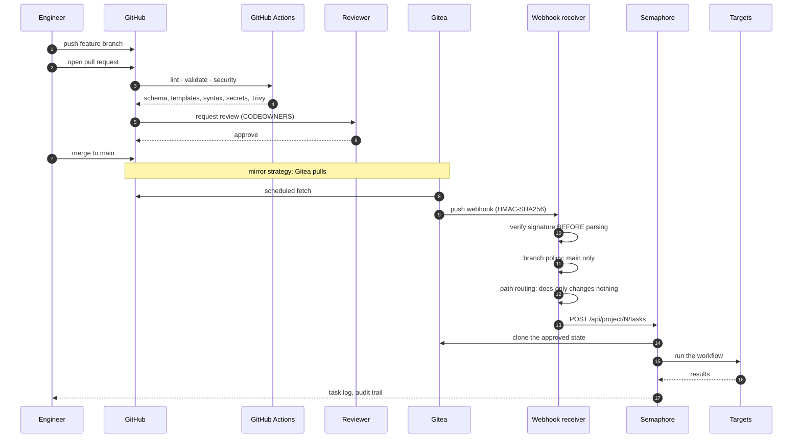

# GitOps workflow

How a change reaches a machine, and everything that has to happen first.

---

## The path



Three properties matter more than the diagram:

1. **Semaphore never reads GitHub.** It reads Gitea, which mirrors
   `main`. A feature branch cannot reach a machine even if someone
   triggers a task by hand.
2. **The webhook verifies before it parses.** An unverified webhook is
   an unauthenticated "please deploy this".
3. **A docs-only commit runs nothing.** Path routing decides, and the
   default for anything else is the *validation* template — not a full
   reprovision.

---

## Two integration strategies

Set by `gitops.sync_strategy` in `config/poc.yml`.

### `mirror` — the default

Gitea **pulls** from GitHub on a schedule (`GITEA_MIRROR_INTERVAL`,
default 10 minutes).

```text
GitHub (main) ──pull──► Gitea ──webhook──► Semaphore
```

| | |
|---|---|
| **GitHub holds no Gitea credential** | A compromised Actions runner cannot push to the GitOps repository |
| The Gitea repository is read-only | Its branch protection is moot; the review gate lives in GitHub |
| Propagation is delayed | Up to the mirror interval |

This is the default because the credential asymmetry is worth more than
the latency. Force a sync from the Gitea UI: **Settings → Mirror →
Synchronize Now**.

### `push` — the alternative

GitHub Actions pushes approved `main` commits into Gitea.

```text
GitHub (main) ──Actions push──► Gitea ──webhook──► Semaphore
```

| | |
|---|---|
| Propagation is immediate | No waiting for a mirror interval |
| **A Gitea credential lives in GitHub secrets** | That is the trade |

To use it, set `sync_strategy: push` and add this workflow:

```yaml
# .github/workflows/sync-to-gitea.yml
name: sync-to-gitea
on:
  push:
    branches: [main]
permissions:
  contents: read
jobs:
  sync:
    runs-on: ubuntu-24.04
    steps:
      - uses: actions/checkout@v4
        with:
          fetch-depth: 0
      - name: Push to Gitea
        env:
          GITEA_URL: ${{ secrets.GITEA_URL }}
          GITEA_TOKEN: ${{ secrets.GITEA_DEPLOY_TOKEN }}
        run: |
          # The token is in the URL, so it must never be echoed.
          git remote add gitea \
            "https://oauth2:${GITEA_TOKEN}@${GITEA_URL}/forge-ai/gitops-infrastructure.git"
          git push gitea main --force-with-lease
```

Scope the token to **`write:repository` on that repository only** — not
`sudo`, not organisation-wide.

---

## Setting up the GitHub repository

```bash
gh repo create danielesalpietro/FORGE-AI --private \
  --description "GitOps infrastructure provisioning proof of concept"

git init
git add .
git commit -m "feat: initial FORGE-AI platform"
git branch -M main
git remote add origin git@github.com:danielesalpietro/FORGE-AI.git
git push -u origin main
```

### Branch protection

Settings → Branches → Add rule, for `main`:

| Setting | Value | Why |
|---|---|---|
| Require a pull request before merging | on | Nothing reaches `main` unreviewed |
| Required approvals | 1 (2 for a shared environment) | |
| Dismiss stale approvals on new commits | on | An approval covers what was reviewed, not what was pushed afterwards |
| **Require review from Code Owners** | on | This is what makes `.github/CODEOWNERS` a control rather than a suggestion |
| Require status checks to pass | on | |
| Required checks | `lint`, `validate`, `security` | |
| Require branches to be up to date | on | Catches semantic conflicts CI would otherwise miss |
| Require conversation resolution | on | |
| Require signed commits | recommended | A stolen token is then not sufficient |
| Do not allow bypassing | on | Including administrators |
| Allow force pushes | **off** | |
| Allow deletions | **off** | |

### Repository secrets

Only what genuinely has to leave GitHub:

| Secret | Needed for | Scope |
|---|---|---|
| `GITEA_URL` | `push` strategy only | Hostname, not a credential |
| `GITEA_DEPLOY_TOKEN` | `push` strategy only | `write:repository`, that repository only |

`mirror` needs neither. That is the point of it.

### Repository variables

| Variable | Used by |
|---|---|
| `FORGE_WINDOWS_ISO` | The self-hosted e2e workflow — a **path on the runner**, not the media |

---

## Gitea

`ansible/roles/gitea_config` creates the organisation, the repository
and the webhook through the REST API.

### Token scope

Create it with the minimum the automation needs:

```bash
docker compose exec -u git gitea gitea admin user generate-access-token \
  --username forgeadmin \
  --token-name forge-ai-automation \
  --scopes write:organization,write:repository
```

**Not `sudo`.** `bootstrap.sh` does this automatically and stores the
result in the vault.

Gitea shows a token **once**. If you lose it, delete the token in
Settings → Applications and create a new one — the role's error message
says exactly this, because it is not obvious.

### The webhook

| Field | Value |
|---|---|
| Target URL | `http://webhook:8000/webhook` (internal to the Docker network) |
| Content type | `application/json` |
| Secret | Must equal `FORGE_WEBHOOK_SECRET` in `compose/.env` |
| Trigger | Push events only |
| Branch filter | `main` |

### Branch protection in Gitea

**Not configured automatically**, and the role says so. Gitea's
branch-protection payload has changed shape between releases, and a
silently-wrong API call leaves the branch unprotected — worse than not
trying. The role prints the exact UI steps and the URL.

With `mirror` this is largely moot: the Gitea repository is read-only
and the review gate is in GitHub.

---

## The webhook receiver

`compose/webhook/app.py`. Standard library only, so there is no
dependency surface beyond the pinned Python base image.

### What it does, in order

1. **Verify HMAC-SHA256 over the raw body** using
   `hmac.compare_digest`, before parsing anything. An empty secret
   rejects every request rather than accepting all of them.
2. **Check the event type.** Anything other than `push` is
   acknowledged and ignored.
3. **Apply the branch policy.** Only `gitops.default_branch` triggers
   anything.
4. **Route by path.** First match wins:

```json
[["docs/**", null], ["*.md", null], ["LICENSE", null], ["**", 9]]
```

A route only wins if **every** changed path matches it, so a commit
touching both `docs/` and `ansible/` falls through to the catch-all
rather than being treated as docs-only.

1. **Start the Semaphore task.**

### Configuring the routes

`semaphore_config` prints the exact lines after creating the templates:

```text
FORGE_TEMPLATE_ROUTES=[["docs/**",null],["*.md",null],["**",10]]
SEMAPHORE_PROJECT_ID=1
```

Put them in `compose/.env` and restart the receiver.

The default catch-all points at the **validation** template, not a full
reprovision. A push should not rebuild two virtual machines without
someone choosing to.

### Testing it

```bash
docker compose logs -f webhook

# Dry run: log what would be triggered, call nothing
FORGE_WEBHOOK_DRY_RUN=true docker compose up -d webhook
```

---

## Semaphore

Thirteen templates, created by `ansible/roles/semaphore_config`:

| # | Template | Destructive |
|---|---|---|
| 01 | Validate prerequisites | |
| 02 | Deploy provisioning services | |
| 03 | Prepare Ubuntu media | |
| 04 | Prepare Windows media | |
| 05 | Create target VMs | |
| 06 | Provision Ubuntu | |
| 07 | Provision Windows | |
| 08 | Configure Ubuntu | |
| 09 | Configure Windows | |
| 10 | Validate deployment | |
| 11 | Detect drift | |
| 12 | Reconcile drift | |
| **99** | **DESTROY the PoC** | **yes** |

Template 99 is numbered to sort last and has a **required** survey
variable. That is a usability control, not a security one:
`destroy-poc.yml` asserts the same token on the Ansible side, which is
what protects against someone calling the API directly.

`docs/SEMAPHORE-SETUP.md` covers the details.

---

## Conventional Commits

Commit messages follow [Conventional
Commits](https://www.conventionalcommits.org/), because `CHANGELOG.md`
and the version bump are derived from them.

```text
<type>(<scope>): <description>

[body]

[BREAKING CHANGE: what an operator must do]
```

| Type | Version impact |
|---|---|
| `feat` | minor |
| `fix` | patch |
| `docs`, `test`, `refactor`, `chore`, `ci`, `style`, `perf` | none |
| `BREAKING CHANGE:` in the footer | **major** |

Scopes used here: `config`, `ansible`, `pxe`, `windows`, `ubuntu`,
`compose`, `security`, `docs`, `ci`, `tests`.

```text
feat(pxe): add UEFI HTTP Boot support for client-arch 16

Firmware with UEFI 2.5+ can fetch the boot binary over HTTP instead of
TFTP, which is markedly faster and avoids TFTP's lock-step ACK.

Requires dhcp-option-force=tag:efihttp,60,HTTPClient -- the firmware
will not accept a URL as a boot filename without the vendor class.
```

---

## Releasing

```bash
# 1. Add the entry FIRST -- the release workflow fails without it
$EDITOR CHANGELOG.md

git add CHANGELOG.md
git commit -m "chore(release): prepare 1.2.0"
git push origin main

# 2. Tag it
git tag -a v1.2.0 -m "FORGE-AI 1.2.0"
git push origin v1.2.0
```

`release.yml` then:

1. validates the tag is semantic and **on `main`**;
2. **fails if `CHANGELOG.md` has no entry** for it — a release nobody
   can review is not a release;
3. re-runs the whole validation suite;
4. builds the archive from an **allowlist**, then re-inspects it for
   media, keys and operator files;
5. records SHA-256 sums;
6. publishes with notes extracted from the changelog.

Dry run without publishing: **Actions → release → Run workflow**.

---

## The deployment path, stated plainly

```text
feature branch
    → pull request
    → lint, validate, security
    → CODEOWNERS review
    → merge to main
    → Gitea synchronisation
    → HMAC-verified webhook
    → branch and path policy
    → Semaphore workflow
    → targets
```

**Nothing on an unreviewed branch reaches a machine.** That is the
property the whole arrangement exists to provide; everything else is
mechanism.
