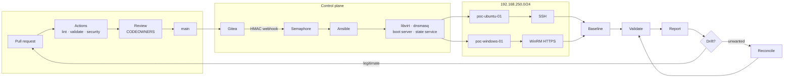

# FORGE-AI

**From a Git commit to two running, configured, verified machines —
with nothing touched by hand.**

FORGE-AI is a working proof of concept for GitOps infrastructure
provisioning. It takes an Ubuntu Server and a Windows Server virtual
machine from bare disk to operational — network boot, unattended
installation, post-install configuration, compliance validation, drift
detection and reconciliation — all driven by a declarative desired state
in version control.

```text
commit → GitHub Actions → Gitea → webhook → Semaphore → Ansible
       → KVM/libvirt → PXE/iPXE → unattended install → SSH/WinRM
       → baseline → validation → report → drift → reconcile
```

> **Status — v0.1.0, validated on real hardware (2026-08-30).**
> Both provisioning paths have completed end-to-end on a physical
> deployment: `make provision-ubuntu` and `make provision-windows`, each
> from bare disk to an OS reachable by Ansible, exit code 0, nothing
> touched by hand. The campaign that got there — 42 bugs found, fixed and
> regression-tested on real hardware — is recorded commit by commit in
> the [logbook](https://github.com/danielesalpietro/FORGE-AI/tree/develop/docs/logbook).

---

## This wiki, and where the truth lives

The repository is the source of truth. Every document under `docs/` is
reviewed, linted and link-checked in CI alongside the code it describes,
so it cannot drift away from the implementation without someone
noticing.

**This wiki is the map, not the territory.** It exists to answer
"where do I start?" and "which document answers my question?" — it
points at the repository rather than copying it. If a page here ever
contradicts `docs/`, the repository wins, and the page is the bug.

---

## Start here

Pick the row that matches why you are reading.

| You want to | Read |
|---|---|
| **Understand what this is** in ten minutes | [README](https://github.com/danielesalpietro/FORGE-AI/blob/develop/README.md) |
| **Run it** on a host you control | [QUICKSTART.md](https://github.com/danielesalpietro/FORGE-AI/blob/develop/docs/QUICKSTART.md) |
| **Understand how it works**, including every designed-in failure mode | [ARCHITECTURE.md](https://github.com/danielesalpietro/FORGE-AI/blob/develop/docs/ARCHITECTURE.md) |
| **Operate it** day two — drift, reports, recovery | [OPERATIONS.md](https://github.com/danielesalpietro/FORGE-AI/blob/develop/docs/OPERATIONS.md) |
| **Judge it** honestly before adopting anything | [LIMITATIONS.md](https://github.com/danielesalpietro/FORGE-AI/blob/develop/docs/LIMITATIONS.md) and [SECURITY.md](https://github.com/danielesalpietro/FORGE-AI/blob/develop/docs/SECURITY.md) |
| **Show it** to someone in 30–45 minutes | [DEMO-RUNBOOK.md](https://github.com/danielesalpietro/FORGE-AI/blob/develop/docs/DEMO-RUNBOOK.md) |
| **Fix something** that is not working | [TROUBLESHOOTING.md](https://github.com/danielesalpietro/FORGE-AI/blob/develop/docs/TROUBLESHOOTING.md) |

---

## The path a commit takes



Two decisions in that diagram are where the design differs most from a
naive pipeline:

- **Review is a gate, not a formality.** Semaphore reads Gitea, and
  Gitea mirrors `main`. Nothing on a feature branch can reach a machine.
- **Drift never fixes itself.** The report asks whether the deviation is
  legitimate. If it is, the fix is a pull request — not a reconcile that
  erases the evidence.

---

## What it builds

| | |
|---|---|
| **Targets** | `poc-ubuntu-01` (Ubuntu Server 24.04 LTS) and `poc-windows-01` (Windows Server 2025) |
| **From** | No golden image, no manual install, no console access |
| **Over** | PXE/iPXE, UEFI-first, architecture-aware, on an isolated `192.168.250.0/24` bridge |
| **Unattended by** | Subiquity autoinstall and `Autounattend.xml`, both generated from the desired state |
| **Configured by** | Ansible over SSH and WinRM/HTTPS — 17 roles, 15 playbooks |
| **Verified by** | Reading the machines back, not by trusting an exit code |
| **Described in** | One file: `config/poc.yml` |

---

## What is proven, and what is not

Being specific about this is the point of the project, not a caveat
bolted on at the end.

**Proven on real hardware.** Both provisioning paths, end to end, from
bare disk to an Ansible-reachable OS — see the
[logbook](https://github.com/danielesalpietro/FORGE-AI/tree/develop/docs/logbook)
for what each run actually did.

**Proven in CI on every push.** 245 tests — 216 unit and 29 shell —
plus schema validation, all 23 templates rendered under
`StrictUndefined`, `Autounattend.xml` parsed pass by pass, the
reinstall-loop guard, and secret hygiene tested against *planted*
secrets rather than a clean tree. GitHub-hosted runners have no nested
virtualisation, so CI creates no VM: the end-to-end workflow exists at
`.github/workflows/e2e-selfhosted.yml`, **disabled rather than
deleted**, so that gap stays checkable.

**Not yet run as one continuous pipeline.** `make configure` → smoke
test → idempotence → drift has not been exercised in a single pass on
the validated deployment. That is the first item of the project review,
tracked as issue
[#5](https://github.com/danielesalpietro/FORGE-AI/issues/5).

**Deliberately out of scope for a PoC.** Secure Boot is off, WinRM uses
a self-signed certificate, there is one shared local administrator
password, and Windows media is operator-supplied — no Microsoft ISO,
binary or product key is distributed by this repository. Each item is
listed with its production alternative in
[LIMITATIONS.md](https://github.com/danielesalpietro/FORGE-AI/blob/develop/docs/LIMITATIONS.md)
and [SECURITY.md](https://github.com/danielesalpietro/FORGE-AI/blob/develop/docs/SECURITY.md).

---

## Before you run it

**This project runs a DHCP server.** It is bound to an isolated libvirt
bridge and nothing else, which is what makes it safe — but if
`provisioning_network` points at a subnet that already exists on your
LAN, you will hand addresses to machines that have nothing to do with
this PoC, and the failure will be intermittent enough to get blamed on
something else.

`make check` runs 34 read-only prerequisite checks and probes for a
competing DHCP server before anything is created. Do not skip it.

Minimum host: Ubuntu 24.04 LTS on x86_64 with hardware virtualisation,
16 GB RAM, 150 GB free disk, root or sudo, and outbound HTTPS. The
memory and disk figures are computed from your `config/poc.yml`, not
hardcoded.

---

## Where the project is going

Each initiative is a GitHub issue broken into sub-issues with per-phase
checklists.

| Initiative | Issue |
|---|---|
| **Project review** — consolidation, unattended tests directly on ESXi, then the full pipeline | [#5](https://github.com/danielesalpietro/FORGE-AI/issues/5) |
| **Self-hosted runner** on real hardware, for the regressions that only reproduce there | [#10](https://github.com/danielesalpietro/FORGE-AI/issues/10) |
| **Environment lifecycle** — Dev → Staging → Prod on ESXi, versioned promotion, go/no-go and rollback | [#11](https://github.com/danielesalpietro/FORGE-AI/issues/11) |
| **Asset inventory (`dims.db`)** — hardware and software as data generated from the live systems, SBOM included | [#15](https://github.com/danielesalpietro/FORGE-AI/issues/15) |
| **Secrets vault** — one place for every secret, then SSL keys and an internal CA | [#20](https://github.com/danielesalpietro/FORGE-AI/issues/20) |
| **`dims` control plane** — multi-node API and a pipe-composable CLI over environments | [#26](https://github.com/danielesalpietro/FORGE-AI/issues/26) |

---

## Taking part

Issues and pull requests are on
[GitHub](https://github.com/danielesalpietro/FORGE-AI). In short:
`make validate` must pass, new behaviour needs a test, and say what you
actually verified — "I deployed the Ubuntu target; the Windows path is
untested because I have no media" is far more useful than an unqualified
tick. See
[CONTRIBUTING.md](https://github.com/danielesalpietro/FORGE-AI/blob/develop/CONTRIBUTING.md).

Security reports go through
[SECURITY.md](https://github.com/danielesalpietro/FORGE-AI/blob/develop/SECURITY.md),
not a public issue.

Licensed under the Apache License 2.0 — chosen over MIT for its explicit
patent grant and its requirement to state changes. Third-party
components and the attribution they require are in
[THIRD_PARTY_NOTICES.md](https://github.com/danielesalpietro/FORGE-AI/blob/develop/THIRD_PARTY_NOTICES.md).
